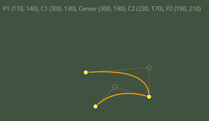

## Plain typescript SVG bezier curve rendering

Vanilla project, no packages required.  
An example of how to render a bezier quadratic curve using SVGPath and draggable points and control points.  



How to run:
- either simply clone and load index.html in your browser or
- for live reload
	- start typescript watch in a terminal. ```>>tsc -w```
	- run live server extension for VSCode ```ritwickdey.liveserver```
